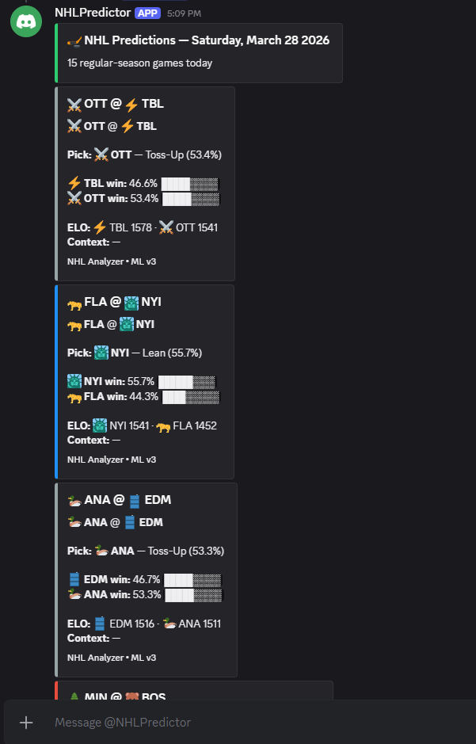
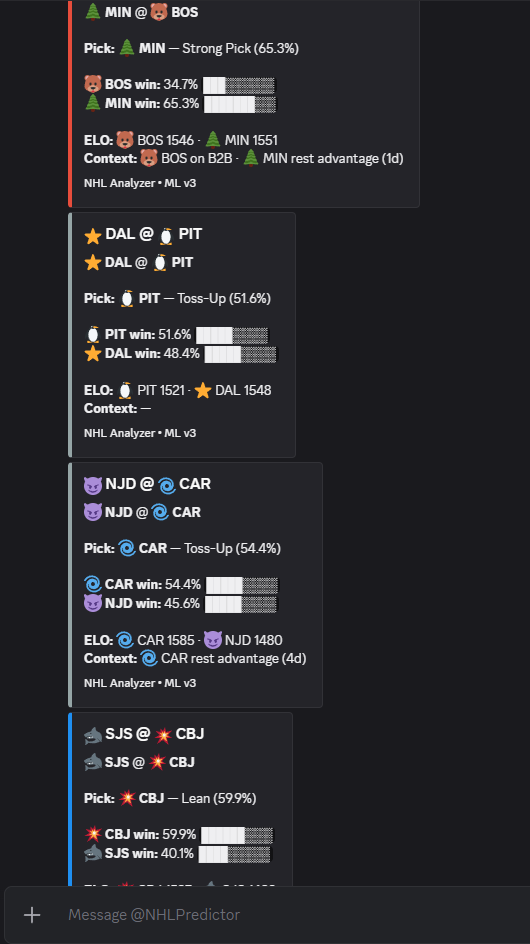
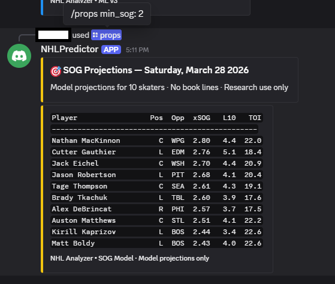

# NHLAnalyzer

A machine learning system that predicts NHL game outcomes using historical stats, team strength ratings, and advanced hockey analytics. Built for research and educational purposes.

## What Does It Do?

Before each NHL game, the system looks at how both teams have been playing recently — their shot quality, scoring trends, special teams performance, goalie form, and overall strength — then estimates the probability of each team winning. These predictions are delivered via a Discord bot.

## How Good Is It?

The best model correctly picks the winner **~57.5% of the time** with a Brier score of **0.2404**. For context:

- **A coin flip** would be right 50% of the time (Brier = 0.2500)
- **Vegas sportsbooks** are right roughly 58-60% of the time
- **The theoretical best** anyone could do for NHL is probably around 60-62%, because hockey has more randomness (parity) than most other sports

So the model is meaningfully better than guessing but still below the sharpest sportsbooks — which is expected, since books have access to injury reports, lineup data, and market-driven information that this model doesn't use.

---

## Understanding the Numbers

### Brier Score (lower = better)

The main metric. It measures how **calibrated** the probabilities are — not just whether you picked the right team, but whether your confidence was appropriate.

- If you say "Team A has a 70% chance" and they win, that's good.
- If you say "Team A has a 70% chance" and they lose, that's bad — but not terrible, because you only said 70%, not 100%.
- If you say "Team A has a 90% chance" and they lose, that's **really** bad. You were overconfident.

**Brier score = average of (predicted probability - actual outcome)^2**

| Brier Score | What It Means |
|-------------|---------------|
| 0.2500 | Coin flip — no skill at all |
| 0.2450 | Slightly better than random |
| 0.2420 | Solid model — this is where most sports models land |
| 0.2400 | Very good for NHL |
| 0.2300 | Exceptional — approaching the limits of prediction |
| 0.0000 | Perfect (impossible in practice) |

Our best model: **0.2404**

### AUC (Area Under the ROC Curve) — higher = better

Measures how well the model **separates winners from losers**, regardless of the exact probabilities. Think of it as: "If I randomly pick one game the home team won and one game they lost, how often does the model assign a higher probability to the correct game?"

| AUC | What It Means |
|-----|---------------|
| 0.500 | No better than random |
| 0.600 | Decent signal |
| 0.612 | Our best model |
| 0.700 | Very strong (rare for NHL) |
| 1.000 | Perfect |

### Accuracy

The simplest metric — what % of games did the model pick the winner correctly? The model picks whichever team has >50% probability.

Our best model: **57.5%** (vs 50% for random guessing)

Accuracy is less informative than Brier score because it ignores confidence. A model that says "51% home win" and one that says "85% home win" both count the same if the home team wins, but the second model was clearly more useful.

### Walk-Forward Validation

We don't just test on random games — that would be cheating (the model could learn from future data). Instead, we train on past seasons and test on the next season, moving forward through time:

```
Fold 1: Train on 2021-22                          -> Test on 2022-23
Fold 2: Train on 2021-22, 2022-23                 -> Test on 2023-24
Fold 3: Train on 2021-22 through 2023-24          -> Test on 2024-25
Fold 4: Train on 2021-22 through 2024-25          -> Test on 2025-26
```

This simulates real-world usage: the model only ever sees past data when making predictions. The "WAVG" (weighted average) combines all folds, weighting by how many games each fold had.

The fold list is derived from `config/season.py`, so it extends by itself each season — as does the XGBoost hyperparameter tuning split, which always validates on the second-most-recent season and leaves the newest one as an untouched holdout.

---

## Understanding the Features

"Features" are the inputs the model uses to make predictions. We have **290** of them. Here are the main categories:

### Team Rolling Stats
Stats averaged over a team's recent games. "L5" means last 5 games, "L10" means last 10, "L20" means last 20.

- **xGF% (expected goals for percentage)** — Based on shot quality models, what percentage of the expected goals belong to this team? Above 50% = good offense and defense. The single best team-level stat in hockey analytics.
- **CF% (Corsi for percentage)** — What percentage of total shot attempts (including blocked/missed) belong to this team? Measures puck possession.
- **SF% (shots for percentage)** — Same as Corsi but only counting shots on goal.
- **Goals for/against** — Actual goals scored and allowed.
- **High-danger chances** — Scoring chances from the most dangerous areas of the ice.

### EWM (Exponentially Weighted Mean)
Same stats as above, but **recent games count more**. A game from last week matters roughly twice as much as a game from 2 weeks ago. This captures "hot streaks" and "cold streaks" better than flat averages. These turned out to be some of the most important features in the model.

### Home/Away Splits
Some teams play very differently at home vs on the road (think Colorado's altitude advantage). These features compute rolling stats using **only home games** for the home team and **only away games** for the away team.

### ELO Ratings
A chess-style rating system adapted for hockey. Every team starts at 1500 and gains/loses points after each game based on whether they beat expectations. The **#1 most important feature** in the model by a wide margin.

- A team at **1600+** is elite (think top playoff contenders)
- A team at **1400 or below** is struggling
- The gap between two teams' ELO ratings is the strongest single predictor of who wins

**Overtime and shootout wins count for less.** Around a quarter of NHL games are decided after regulation, and those finishes are close to a coin flip — 3-on-3 and shootouts say far less about which team is better than a regulation result does. Counting them as full wins pushes that noise straight into the model's most important feature, so an OT/SO winner is credited `ot_win_value` (default 0.6) rather than 1.0. The value is part of the tuning grid, and `ot_win_value = 1.0` reproduces the older behaviour, so tuning can only select it if it genuinely helps.

Tuned ELO parameters are saved to `models/saved/elo_params.json` by `python -m features.elo` and read back by the backfill and live pipelines — previously the tuner printed its results and the pipeline carried on using the module defaults.

### Special Teams (PP/PK)
- **PP (Power Play)** — How well does a team score when they have a man advantage?
- **PK (Penalty Kill)** — How well does a team defend when they're shorthanded?

### Goalie Features
Rolling save percentage and goals saved above expected (GSAx) for each team's starting goalie.

### Context Features
- **Back-to-back (B2B)** — Is either team playing their second game in two nights? This is a significant disadvantage.
- **Rest advantage** — How many more days of rest does the home team have?
- **Division/Conference** — Are these divisional rivals who know each other well?

### Opponent Quality
Stats split by whether the opponent was **strong** (above-average ELO) or **weak** (below-average ELO). A team's record against good teams is more informative than their record against bad teams.

### Regulation Win Rate
What percentage of a team's wins come in regulation (3 periods) vs overtime/shootout? Teams that win decisively in regulation tend to be genuinely better, while OT/SO outcomes are closer to coin flips (~50/50).

---

## Understanding the Models

### Random Forest (RF)
Builds hundreds of decision trees, each looking at a random subset of features, then averages their predictions. Good at handling noisy data and doesn't overfit easily. Our baseline workhorse — consistent and reliable.

### XGBoost (XGB)
Builds decision trees sequentially, where each new tree tries to correct the mistakes of the previous ones. More powerful than Random Forest but needs careful tuning to avoid overfitting. With the right feature selection (top 20 features only), it's now our **best model**.

### LightGBM (LGBM)
Similar to XGBoost but uses a different algorithm for building trees. Faster to train but didn't add much beyond what XGB already captures.

### Stacking Meta-Learner
Instead of just averaging model predictions, we train a logistic regression to learn the **optimal blend** of RF, XGB, and LightGBM outputs. In practice, the meta-learner learned to mostly trust RF and XGB while nearly ignoring LightGBM.

### Feature Selection
More features isn't always better. With 290 features, many are noise that confuses the model. By keeping only the **top 20 most important features**, XGBoost's Brier score improved from 0.2416 to 0.2404. Less noise = better predictions.

### Calibration
"Calibration" means adjusting the raw model probabilities so they match reality. If the model says "60% chance" for 100 games, roughly 60 of those games should actually be wins.

We tested three approaches:
- **Isotonic regression** — flexible curve fitting (hurt performance on small samples)
- **Platt scaling** — logistic curve fitting (slight help on small samples)
- **Uncalibrated** — use the raw model probabilities directly (**won** — the models were already well-calibrated naturally)

### SHAP Values
A method for explaining **why** the model made a specific prediction. For each feature, SHAP tells you how much it pushed the prediction up or down. The "mean |SHAP|" ranking tells you which features matter most across all games.

---

## Reliability

Two guardrails sit between the model and what gets posted.

### Training and serving share one code path

The rolling features for a live game are produced by the same function that
builds the training matrix (`features.team.pregame_snapshot`), rather than a
parallel re-implementation. This matters most in October: training rolls
stats strictly within a season, so a live snapshot that carried form across
the season boundary would feed the model inputs it had never been trained
on. `tests/test_team_features.py::TestTrainServeParity` asserts the two
agree on every rolling column.

A team with no games yet gets an all-NaN row instead of being dropped, which
is exactly what the model saw for opening night during training — and means
no game silently disappears from the first few days of the schedule.

### Feature coverage guard

The model pipeline imputes missing values with column means, so an upstream
break used to surface as a plausible-looking 50-something percent rather
than as an error. Every prediction now carries a `feature_coverage` score —
the fraction of the model's features that were actually populated — and
games below 70% are dropped rather than published. The threshold is
adjustable:

```bash
python -m pipeline.live --dry-run --min-coverage 0.9
```

Coverage is written to the prediction history alongside each pick, so
degradation is visible after the fact rather than only in the logs.

One consequence worth knowing: on the opening night of a season no team has
any rolling history, so coverage is very low and the guard withholds those
games. Predictions resume on their own as games accumulate. To publish
ELO-and-context-only picks from night one instead, pass a lower threshold —
see [docs/SEASON_ROLLOVER.md](docs/SEASON_ROLLOVER.md).

## Discord Bot

The system delivers predictions through a Discord bot with slash commands.

### /predictions — Game Win Probabilities

Shows each game with win probabilities, pick strength, ELO ratings, and context (back-to-back, rest advantage).




### /props — SOG Projections

Shows projected shots on goal for skaters, with recent averages and ice time.



### Other Commands

- **/elo** — Current ELO rankings for all 32 teams
- **/history** — Prediction accuracy tracker (win rate, Brier score, calibration)

---

## Quick Start

```bash
# Install dependencies
pip install -r requirements.txt

# Run the test suite (synthetic data only — no network, no Postgres)
pytest

# Set environment variables (optional — works without Postgres)
# DATABASE_URL=postgresql://localhost/nhl_ml

# Build the feature matrix (processes raw MoneyPuck data)
python -m pipeline.backfill

# Train the model
python -m pipeline.train --model random_forest

# Daily workflow: refresh data, score old predictions, predict today's games
python -m pipeline.daily

# Get today's predictions (without refreshing data)
python -m pipeline.live --dry-run

# Get predictions for a specific date
python -m pipeline.live --date 2026-03-15 --dry-run

# Post predictions to Discord
DISCORD_WEBHOOK_URL=https://discord.com/api/webhooks/... python -m bot.discord_bot --webhook

# Run the Discord bot (slash commands: /predictions, /props, /elo, /history)
DISCORD_BOT_TOKEN=... python -m bot.discord_bot --bot

# Evaluate prediction accuracy over time
python -m pipeline.evaluate_history

# Tune ELO parameters and persist them for the pipelines to use
python -m features.elo
```

Postgres is optional throughout — every path falls back to Parquet, and the
`psycopg2` driver is only imported when a `DATABASE_URL` is actually set.

### Starting a new season

Adding the new season's opening date to `config/season.py` is the only edit
required; everything else derives from it and the current date. See
[docs/SEASON_ROLLOVER.md](docs/SEASON_ROLLOVER.md) for the full checklist.

## Project Structure

```
NHLAnalyzer/
  config/
    season.py               # Single source of truth for seasons + start dates
  data/
    raw/                    # MoneyPuck CSV downloads (cached)
    parquet/                # Processed data files
    predictions/            # Prediction history log
  features/
    team.py                 # Rolling team stats, EWM, venue splits
    context.py              # Rest, B2B, division flags
    elo.py                  # ELO rating system
    goalie_mp.py            # Goalie features from MoneyPuck
    special_teams.py        # Power play / penalty kill
    opponent_quality.py     # Stats vs strong/weak opponents
    player.py               # Player-level SOG features
  models/
    baseline.py             # RF + Logistic Regression baselines
    xgboost_model.py        # XGBoost + LightGBM + ensemble
    stacking.py             # Stacking meta-learner
    sog_model.py            # Shots on goal (player props)
    evaluate.py             # Evaluation metrics framework
    saved/                  # Serialized trained models
  pipeline/
    backfill.py             # Build historical feature matrix
    train.py                # Train and save production model
    live.py                 # Generate live predictions
    props_live.py           # Player prop predictions
    daily.py                # One-command daily pipeline (refresh + score + predict)
    evaluate_history.py     # Backfill prediction outcomes
  bot/
    discord_bot.py          # Discord webhook + slash commands
  ingestion/
    moneypuck.py            # MoneyPuck data downloader
    nhl_api.py              # NHL Stats API client
    odds_api.py             # Odds API client
  tests/                    # Pytest suite (synthetic data, no network/DB)
  docs/
    SEASON_ROLLOVER.md      # Pre-season checklist
  results/                  # Model evaluation reports
```
